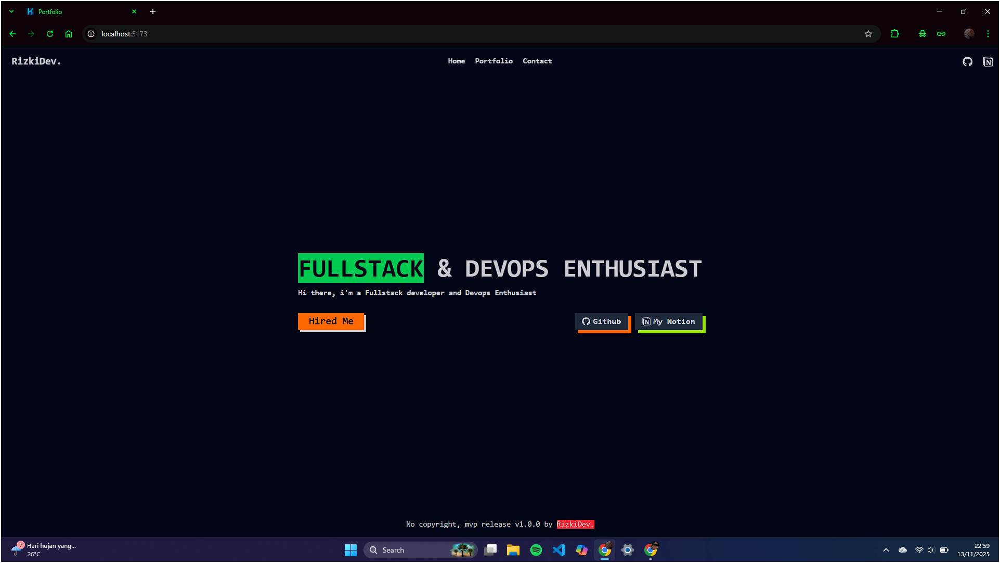
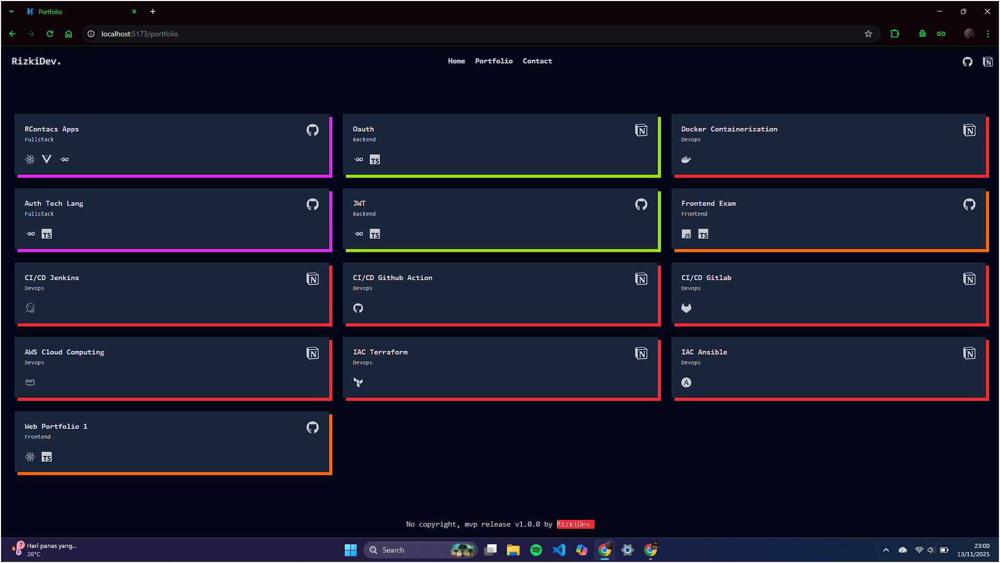
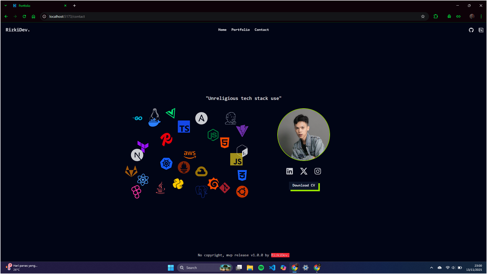
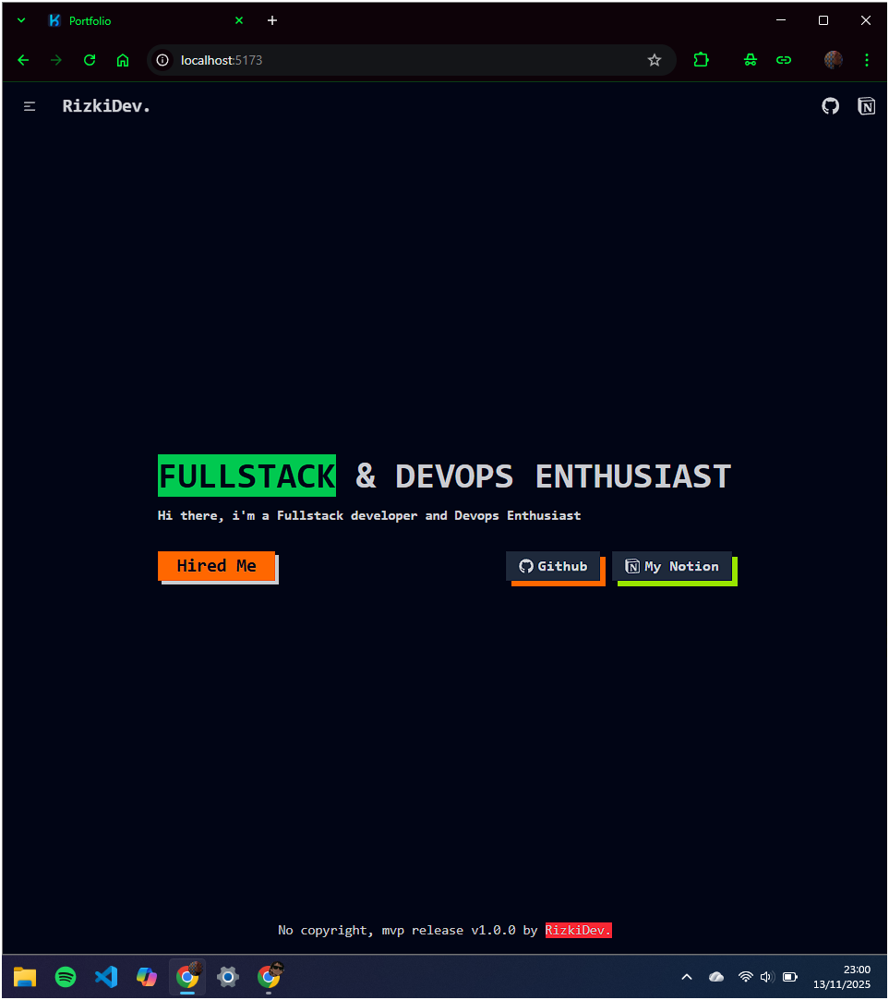
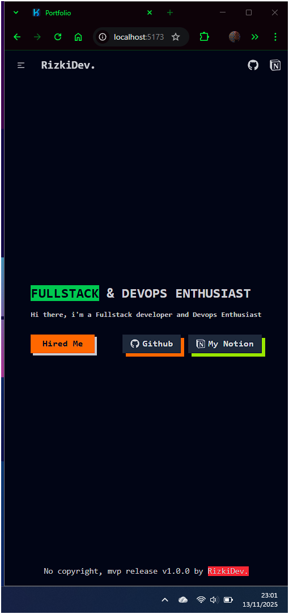
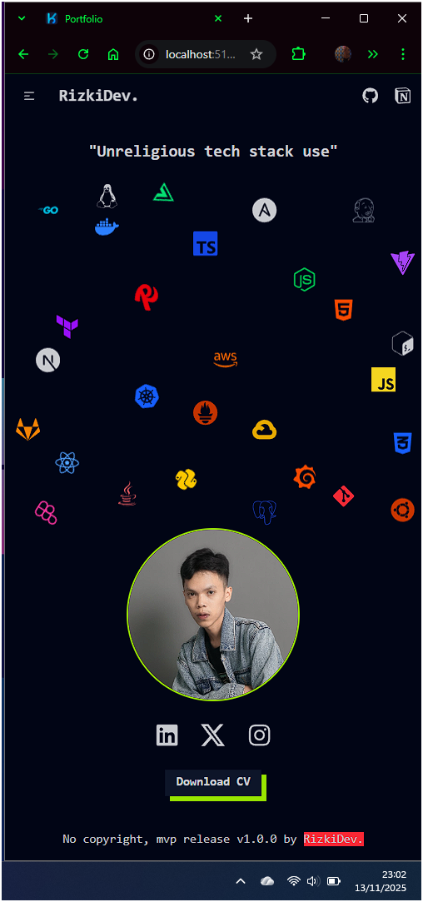
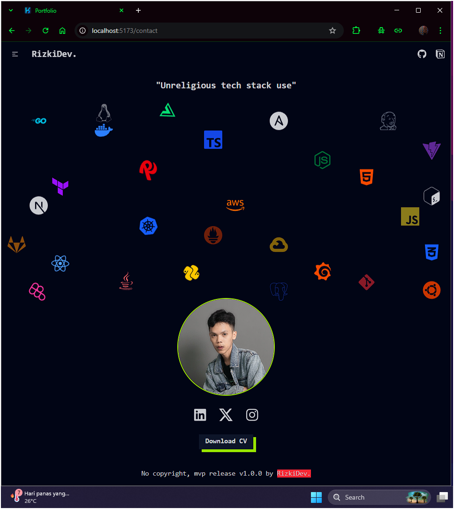

# Portfolio Project

This is a portfolio website built with React, TypeScript, and Tailwind CSS.

## Demo

<!-- [Watch the demo video here](./assets/record.mp4) -->

## Screenshots

| | |
|:-------------------------:|:-------------------------:|
|   |   |
|   |   |
|   |   |
|   |   |

## Tech Stack

## Dependencies

- **react:** ^19.1.1
- **react-dom:** ^19.1.1
- **react-icons:** ^5.5.0
- **react-router:** ^7.9.5
- **tailwindcss:** ^4.1.16

## Dev Dependencies

- **@eslint/js:** ^9.36.0
- **@types/node:** ^24.6.0
- **@types/react:** ^19.1.16
- **@types/react-dom:** ^19.1.9
- **@vitejs/plugin-react:** ^5.0.4
- **daisyui:** ^5.3.10
- **eslint:** ^9.36.0
- **eslint-plugin-react-hooks:** ^5.2.0
- **eslint-plugin-react-refresh:** ^0.4.22
- **globals:** ^16.4.0
- **typescript:** ~5.9.3
- **typescript-eslint:** ^8.45.0
- **vite:** ^7.1.7
